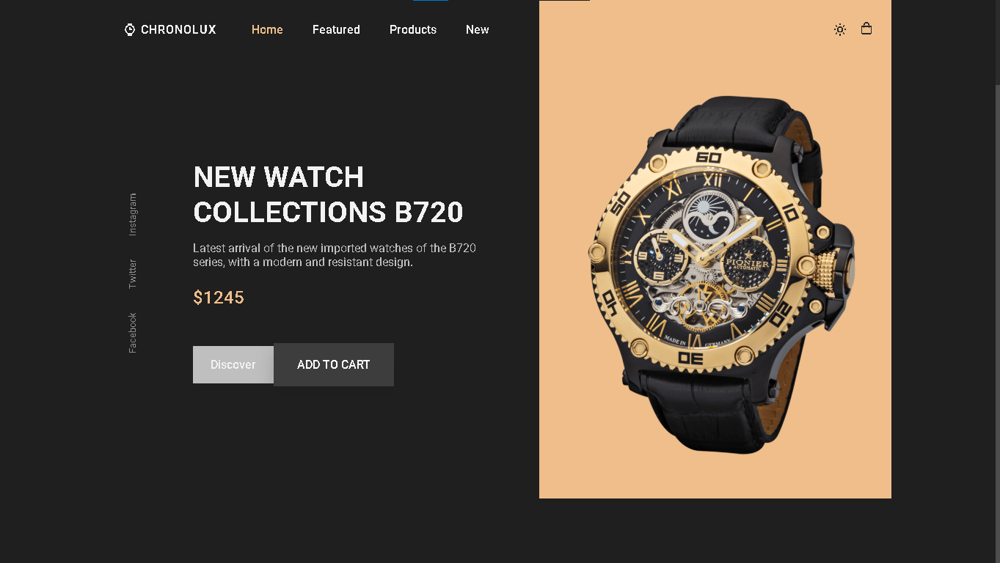
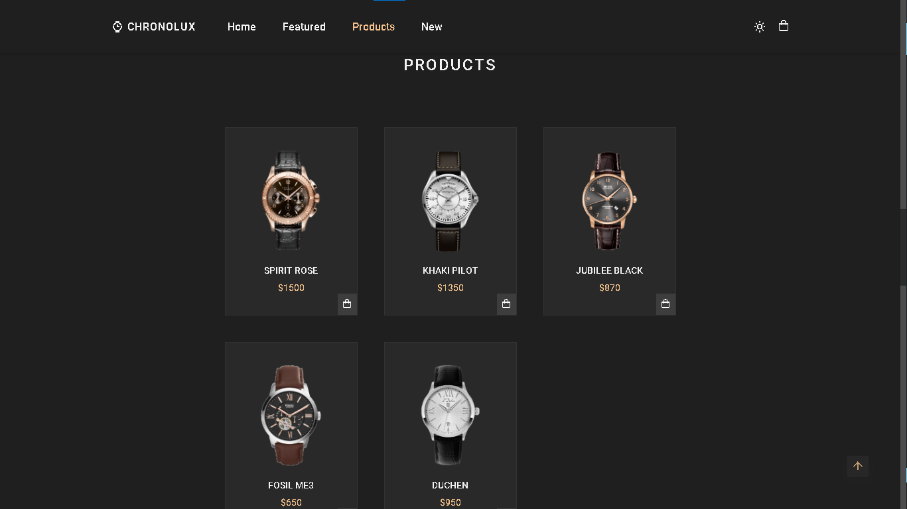
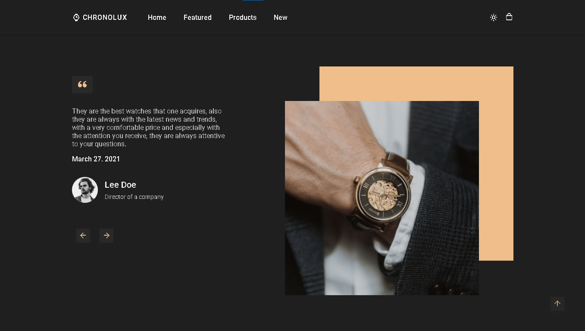

# ChronoLux - Luxury Watch E-commerce Platform



## Overview

ChronoLux is a sophisticated e-commerce platform specializing in luxury timepieces. Built with modern web technologies, our platform offers an elegant and user-friendly shopping experience for watch enthusiasts.

## Features

- **Responsive Design**: Seamlessly adapts to all devices and screen sizes
- **Interactive Product Gallery**: Dynamic image viewing with zoom capabilities
- **Real-time Filtering**: Sort watches by brand, price, style, and features
- **Secure Checkout Process**: Protected payment gateway integration
- **User Authentication**: Personal accounts for order tracking and wishlists
- **Watch Comparison Tool**: Compare different models side by side

## Technology Stack

- HTML5
- CSS3
- JavaScript (Vanilla)



## Project Structure

```
chronolux/
├── index.html
├── img/
├── css/
│   └── style.css
└── js/
    └── main.js
```

## Installation

1. Clone the repository:
```bash
git clone https://github.com/yourusername/chronolux.git
```

2. Navigate to the project directory:
```bash
cd chronolux
```

3. Open `index.html` in your preferred browser

## Usage


To run the website locally:
1. Ensure all files are in their respective directories
2. Open `index.html` in a modern web browser
3. For development, we recommend using a local server like Live Server

## Contributing

We welcome contributions to ChronoLux! Please follow these steps:

1. Fork the repository
2. Create a new branch (`git checkout -b feature/improvement`)
3. Make your changes
4. Commit your changes (`git commit -am 'Add new feature'`)
5. Push to the branch (`git push origin feature/improvement`)
6. Create a Pull Request

## License

This project is licensed under the MIT License - see the [LICENSE](LICENSE) file for details.

## Contact

- Website: [chronolux.com](https://lechehebdjaafar.github.io/ChronoLux/)

